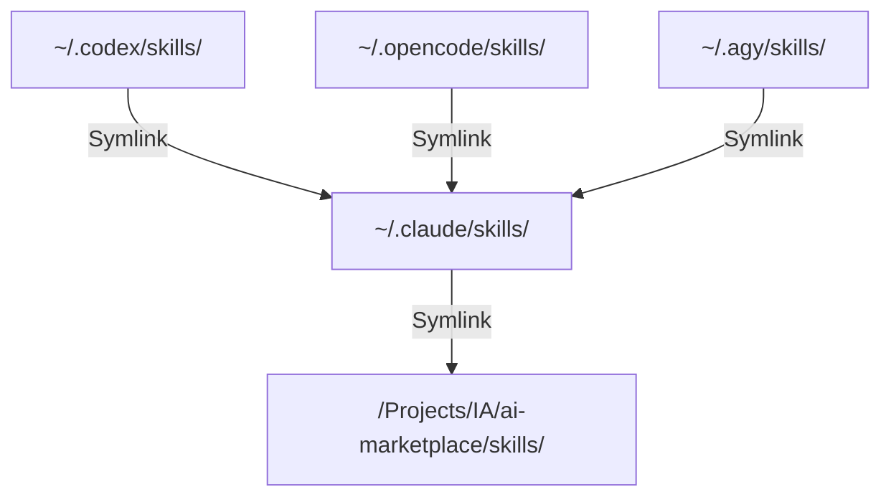

# System Architecture & Symlinking

This document explains how the **AI Marketplace** manages cross-agent skill sharing and the environment setup.

## 🏗️ The Problem: Agent Fragmentation
Different AI command-line assistants (like Claude Code, OpenAI Codex, OpenCode, and Antigravity) use different home directories to store custom skills and plugins:
- **Claude Code**: `~/.claude/skills/`
- **Codex**: `~/.codex/skills/`
- **OpenCode**: `~/.opencode/skills/`
- **Antigravity**: `~/.agy/skills/`

Manually copying scripts and rules between these folders introduces synchronization errors, code drift, and maintenance overhead.

## 🔗 The Solution: Centralized Symlink Sharing
The AI Marketplace solves this by serving as the **single source of truth** for all custom agent behaviors. 

By utilizing symbolic links, all agents are configured to point back to this repository's `skills/` directory.

### Setup Execution
When `scripts/setup-symlinks.sh` is executed, the following operations occur:
1. **Backup**: If an agent folder is a normal directory, it is backed up with a timestamp suffix (e.g., `~/.claude/skills_bak_1718000000`).
2. **Claude Link**: A symbolic link is created at `~/.claude/skills` pointing to the absolute path of this workspace's `skills` folder.
3. **Chained Symlinks**: Links for Codex, OpenCode, and Antigravity are created to reference `~/.claude/skills`.

This chained configuration ensures that any modifications made inside this repository are instantly accessible by every AI assistant.
