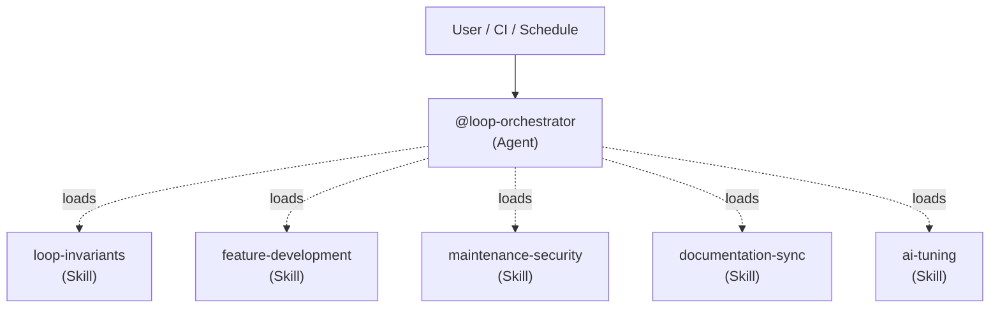

# 🔄 Agentic Value Loops — Orchestration & Setup

## Architecture

## Available Agents

| Agent | Role | Color | Tools |
|-------|------|-------|-------|
| [`loop-orchestrator`](file:///agents/loop-orchestrator.md) | 🔄 Maestro of Value Loops | magenta | Read, Write, Grep, Bash |

## Available Skills

| Skill | Purpose | Cadence |
|-------|---------|---------|
| [`loop-invariants`](file:///skills/loop-invariants/SKILL.md) | As regras inegociáveis que todo loop deve seguir. | Constante |
| [`feature-development-loop`](file:///skills/feature-development-loop/SKILL.md) | Entrega de novas funcionalidades com qualidade. | Per Feature |
| [`maintenance-security-loop`](file:///skills/maintenance-security-loop/SKILL.md) | Bumps de dependência e correções de segurança. | Semanal |
| [`documentation-sync-loop`](file:///skills/documentation-sync-loop/SKILL.md) | Sincroniza as regras e guardrails com o código. | Semanal / Per Merge |
| [`ai-tuning-loop`](file:///skills/ai-tuning-loop/SKILL.md) | Autotuning de inteligência artificial (Holo, Auri). | Per Agent/Category |

## Token Economy
- Os loops utilizam "Progressive Disclosure". O orquestrador começa apenas com os `loop-invariants` e carrega a skill específica (ex: `ai-tuning-loop`) somente quando o trigger apropriado for acionado.
