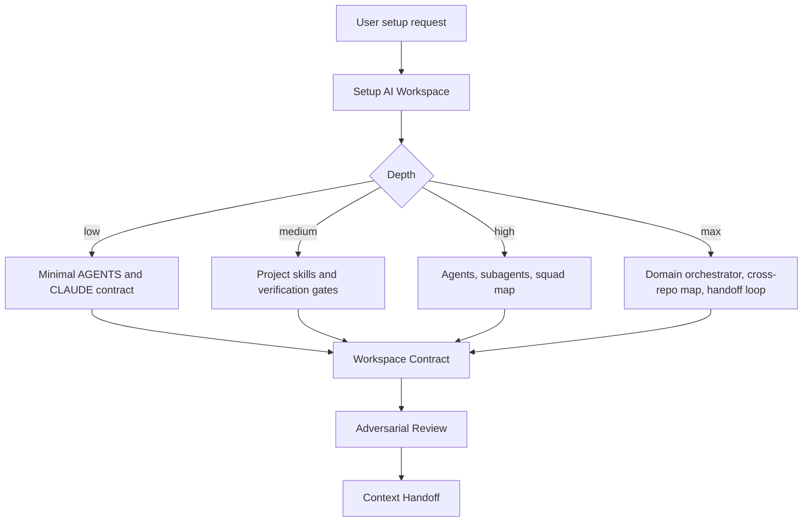

# AI Workspace Orchestrator

Use this plugin to create the AI operating layer for a project, workspace, or domain.

## Core Flow

## Skills

| Skill | Purpose |
| --- | --- |
| `setup-ai-workspace` | Run the question-driven setup wizard and produce the setup profile. |
| `write-project-skill` | Create global or project-local skills with progressive disclosure. |
| `build-agent-orchestrator` | Create a Spotify Squad-style orchestrator and only the needed subagents. |
| `workspace-contract` | Write or update AGENTS.md and CLAUDE.md, including symlink strategy. |
| `adversarial-setup-review` | Review setup changes as a principal engineer before merge. |
| `context-handoff` | Save a compact handoff for another agent or future session. |

## Agent

Use `workspace-orchestrator` for multi-domain setup work. It inspects the current repo before asking and asks one question at a time when a decision cannot be inferred.

## Operating Rules

- Prefer current repo evidence over user guesses when topology can be discovered.
- Ask one decision at a time, with a recommended answer.
- Create only skills and agents tied to present domains.
- For monorepos or multi-repo domains, create one root orchestrator and specialist agents per real boundary.
- Keep `AGENTS.md` canonical. Use a `CLAUDE.md` symlink to `AGENTS.md` when supported; otherwise create a short pointer file.
- Preserve existing project instructions and append a clearly delimited AI workspace block.
- Run adversarial setup review before merging durable workspace instructions.
