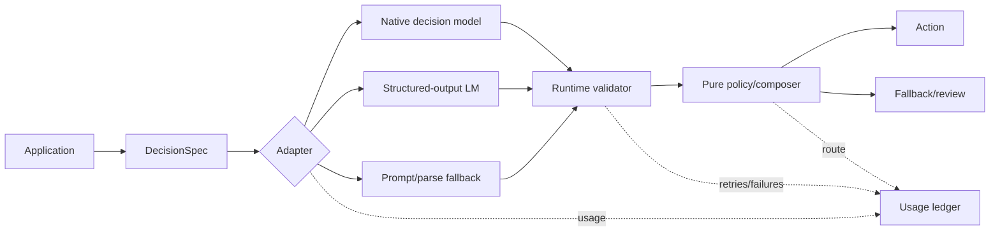

# Type-Safe Contracts

## Boundary

Define one provider-neutral `DecisionSpec`; implement adapters. Internal schemas are not provider wire schemas: adapters enforce current criteria shape, cardinality, context, and media limits.

- `native`: provider returns typed probabilities directly.
- `structured-output`: LM uses JSON Schema/tool calling.
- `prompt-parse`: last-resort JSON extraction; stricter validation and lower trust.

All adapters normalize into same validated result (`references/decision-result.schema.json`). Types generated by SDK do not replace runtime validation. After schema validation, run equivalent of `scripts/validate_result.py`: answer IDs/types match questions, selected Choice exists, probability keys match criteria, distributions sum to 1 within documented tolerance, and Score range matches levels.

## Pipeline

## Failure policy

1. Reject unknown question/result types and missing options.
2. Ensure probability values are finite and within `[0,1]`; validate distribution sum with documented tolerance.
3. Allow at most one schema-repair retry unless evidence justifies more.
4. On invalid/low-confidence output, use declared safe fallback. Never silently coerce.
5. Pin provider model/version after calibration; aliases can move.
6. Hash cache by model/version, canonical state, question semantics, and schema version. Do not include policy weights when raw answers remain reusable.

Preserve raw response for audit after redaction. Never log API keys, secrets, or sensitive state.
