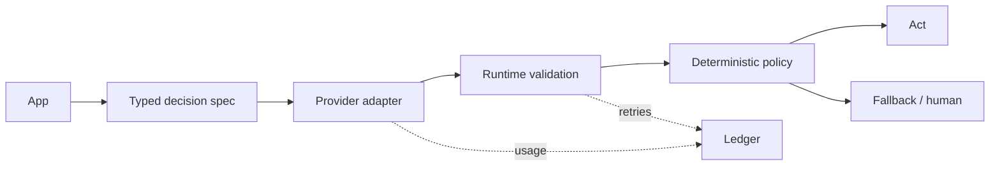

# Typed decisions

Same tasks. Same acceptance criteria. Measured evidence.

---

# Architecture

---

# Comparison

| Metric | Baseline | Candidate | Delta | Evidence |
|---|---:|---:|---:|---|
| Calls | — | — | — | measured |
| Input tokens | — | — | — | measured/estimated |
| Output tokens | — | — | — | measured/estimated |
| Latency p50 / p95 | — | — | — | measured |
| Cost USD | — | — | — | measured/estimated |
| Schema retries | — | — | — | measured |
| Task quality | — | — | — | measured |

---

# Guardrails

- Tokens alone are not comparable across tokenizers.
- Quality gate before savings claim.
- `vendor_claimed` ≠ reproduced.
- Check provider terms before publishing benchmarks.
