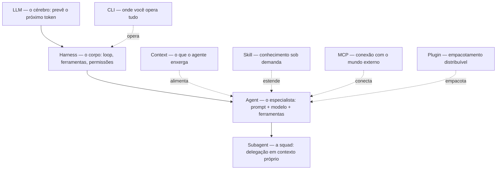

# 🎯 Spotify Squad — AI-Native Engineering Team

> **Agent = LLM + Harness** — Plugin baseado no modelo Spotify de squads autônomas, onde cada agente é um especialista com contexto próprio, skills dedicadas e capacidade de delegação.

## Architecture



## Squad Roster

| Agent | Role | Color | Model | Skills |
|-------|------|-------|-------|--------|
| [`squad-orchestrator`](file:///agents/squad-orchestrator.md) | 🎼 Tech Lead / Orchestrator | cyan | inherit | squad-coordination, new-feature |
| [`backend-engineer`](file:///agents/backend-engineer.md) | ⚙️ Backend Engineer | blue | inherit | backend-patterns, new-db-schema |
| [`frontend-engineer`](file:///agents/frontend-engineer.md) | 🎨 Frontend Engineer | magenta | inherit | frontend-patterns, new-screen |
| [`mobile-engineer`](file:///agents/mobile-engineer.md) | 📱 Mobile Engineer | green | inherit | mobile-patterns, new-screen |
| [`ux-researcher`](file:///agents/ux-researcher.md) | 🔍 UX Researcher | yellow | inherit | ux-research |
| [`ui-designer`](file:///agents/ui-designer.md) | 🎨 UI/Visual Designer | magenta | inherit | ui-design-system |
| [`product-manager`](file:///agents/product-manager.md) | 📋 Product Manager | cyan | inherit | product-discovery |
| [`scrum-master`](file:///agents/scrum-master.md) | 🔄 Scrum Master | yellow | inherit | agile-ceremonies |
| [`devops-engineer`](file:///agents/devops-engineer.md) | 🚀 DevOps Engineer | red | inherit | devops-pipeline, new-repository |
| [`qa-engineer`](file:///agents/qa-engineer.md) | 🧪 QA Engineer | green | inherit | qa-strategy, adversary-review |
| [`data-engineer`](file:///agents/data-engineer.md) | 📊 Data Engineer | blue | inherit | data-pipeline |
| [`security-engineer`](file:///agents/security-engineer.md) | 🛡️ Security Engineer | red | inherit | secure-coding-patterns, adversary-review |

## Orchestration Model

### Manager-Worker Pattern (from AI Native Developer)

```
┌─────────────────────────────┐
│     Squad Orchestrator      │
│     (Tech Lead)             │
│  Decomposes → Delegates →   │
│  Coordinates → Synthesizes  │
└──────────┬──────────────────┘
           │ spawn + delegate
    ┌──────┼──────┬──────┬──────┬──────┬──────┐
    ▼      ▼      ▼      ▼      ▼      ▼      ▼
 Backend Frontend Mobile  UX   DevOps  QA  Security
   │        │       │      │      │      │
   │  Own context window per subagent    │
   │  Only condensed results return      │
   └──────────────┬──────────────────────┘
                  ▼
         Orchestrator synthesizes
         all results → delivers
```

### Context Isolation
- Each subagent runs in **its own context window**
- Prevents context bloat in the orchestrator
- Only **condensed results** return to parent
- Parallel execution for independent tasks

### Plan-Execute-Verify Loop
1. **Plan**: Decompose feature into domain-specific tasks
2. **Execute**: Delegate to specialist agents
3. **Verify**: Validate outputs (tests, reviews, quality gates)
4. **Loop**: If verification fails, re-plan and re-execute

## Skills Map

| Skill | Domain | Used By |
|-------|--------|---------|
| [`squad-coordination`](file:///skills/squad-coordination/SKILL.md) | Orchestration | squad-orchestrator |
| [`backend-patterns`](file:///skills/backend-patterns/SKILL.md) | Backend | backend-engineer |
| [`frontend-patterns`](file:///skills/frontend-patterns/SKILL.md) | Frontend | frontend-engineer |
| [`mobile-patterns`](file:///skills/mobile-patterns/SKILL.md) | Mobile | mobile-engineer |
| [`ux-research`](file:///skills/ux-research/SKILL.md) | UX | ux-researcher |
| [`ui-design-system`](file:///skills/ui-design-system/SKILL.md) | Design | ui-designer |
| [`product-discovery`](file:///skills/product-discovery/SKILL.md) | Product | product-manager |
| [`agile-ceremonies`](file:///skills/agile-ceremonies/SKILL.md) | Agile | scrum-master |
| [`devops-pipeline`](file:///skills/devops-pipeline/SKILL.md) | DevOps | devops-engineer |
| [`qa-strategy`](file:///skills/qa-strategy/SKILL.md) | QA | qa-engineer |
| [`data-pipeline`](file:///skills/data-pipeline/SKILL.md) | Data | data-engineer |
| [`secure-coding-patterns`](file:///skills/secure-coding-patterns/SKILL.md) | Security | security-engineer |
| [`adversary-review`](file:///skills/adversary-review/SKILL.md) | Security | qa-engineer, squad-orchestrator |
| [`new-feature`](file:///skills/new-feature/SKILL.md) | Workflow | squad-orchestrator |
| [`new-screen`](file:///skills/new-screen/SKILL.md) | Workflow | frontend-engineer, mobile-engineer |
| [`new-db-schema`](file:///skills/new-db-schema/SKILL.md) | Workflow | backend-engineer, data-engineer |
| [`new-repository`](file:///skills/new-repository/SKILL.md) | Workflow | devops-engineer |

## Quality Gates

Every agent must pass before completion:
```bash
npm run typecheck    # 0 errors
npm run lint         # clean
npm run test         # relevant tests pass
```

## Spotify Model Mapping

| Spotify Concept | Squad Equivalent |
|----------------|------------------|
| **Squad** | This plugin — self-contained team of 12 agents |
| **Tribe** | Collection of squads aligned to a product area |
| **Chapter** | Cross-squad specialists (all backend agents across squads) |
| **Guild** | Shared skills/knowledge across all squads |
| **Squad Health Check** | scrum-master agent's team health assessment |

## Cost Engineering (Token Discipline)

- **Progressive Disclosure**: Skills load instructions only when invoked
- **Context Isolation**: Subagents have own context windows
- **Result Compression**: Only condensed results return to orchestrator
- **Model Routing**: Use smart-dispatch tier mapping (budget/balanced/quality)
- **Lazy Loading**: Agent descriptions trigger loading, not full prompts

## References

- [AI Native Developer Ebook](https://andersonlimahw.github.io/ebook-ai-native-developer/)
- [Spotify Squad Model](https://engineering.atspotify.com/2014/03/27/spotify-engineering-culture-part-1/)
- [VibingCash .claude/ Reference](https://github.com/vibingcash)
